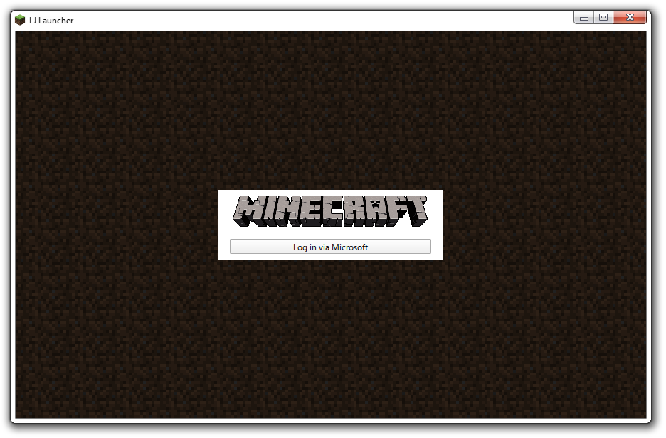

# LegacyJava Launcher
 A recreation of Mojang's Classic Minecraft Launcher
 
## About this Project
This is an accurate-as-possible recreation of Mojang's Classic Minecraft Launcher in Qt Quick and Python. It is based on the launcher discontinued beyond 1.11.2 and features adapted UI and new settings.

I made this in order to understand the fundamentals of how a minecraft launcher works. It taught me how to use dedicated libraries to interact with APIs that provide user authentication, game validity checking and updating attributes. It also required me to create a Microsoft Entra Application, along with applying for access to the Mojang API. It also helped me work with applications that contain different screens, i.e. login screen, main menu, etc. This project incorporates the fundamentals that I learnt from another project, [Run-7](https://github.com/jayrickaby/run-7), to create something that is bigger.

## Features
- Microsoft Authentication
- ~~Player Customisation~~ (TODO)
- ~~Version Configurations, Downloading and Launching~~ (TODO)

## Gallery
