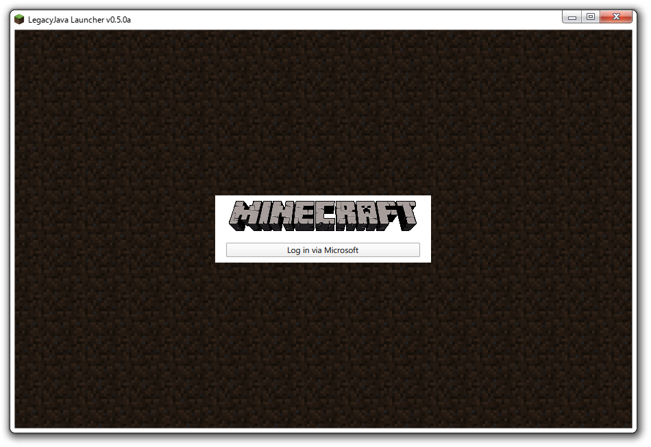
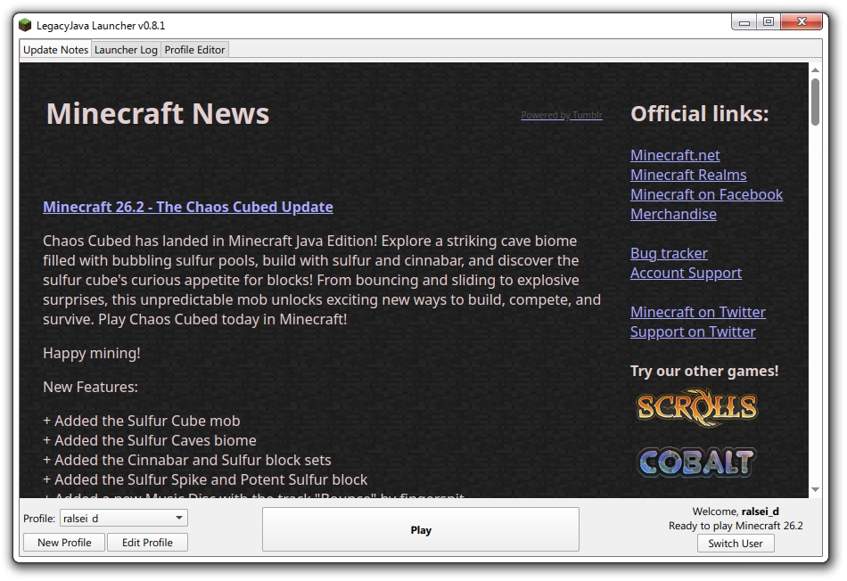
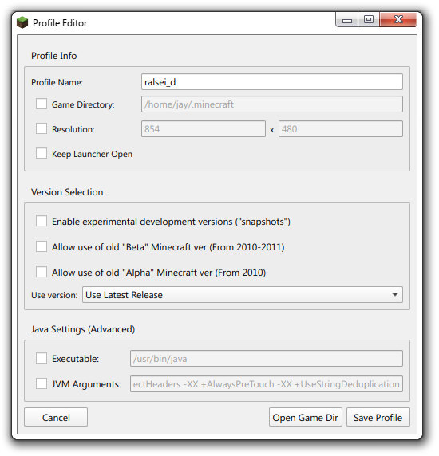
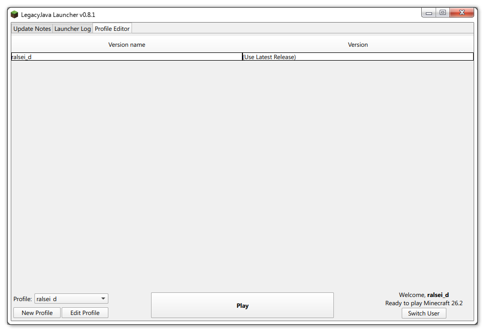

# LegacyJava Launcher
 A recreation of Mojang's Classic Minecraft Launcher
 
## About this Project
**LegacyJava** (LJ) **Launcher** is an accurate-as-possible recreation of the v1.6 Minecraft Launcher from Dec. 2014 to Sept. 2019. It was officially discontinued by Mojang in favour of the v2 launcher, and now currently the v3 launcher. 

This uses Qt Quick, with a backend of C++. Originally it was written in Python, but a massive rewrite had to happen due to the limitations of PySide6. When it was being developed in Python, it had an accompanying [custom launcher utility library](https://github.com/jayrickaby/mc-launcher-utils), but has been discontinued due to the shift in focus on the project. Now the project solely relies on Qt and itself.

The News Page is also a recreation of the [original](https://mcupdate.tumblr.com/) news page, which is being host and continued on the project's [github.io](https://jayrickaby.github.io/lj-launcher/) page.

I made this in order to understand the fundamentals of how a Minecraft Launcher works. It taught me how to manually interact with APIs that provide user authentication, game validity checking, updating attributes and installing core assets, library, and game files. It also required me to create a Microsoft Entra Application, along with applying for access to the Mojang API. It let me create an application containing different screens, i.e. login screen, main launcher, etc. This project incorporates the fundamentals that I learnt from another project, [Run-7](https://github.com/jayrickaby/run-7), to create something that is bigger.

## Features
- Full and Secure Microsoft Authentication
- A full recreation of the MCUpdate Tumblr Blog
- Version Profile Configuration
- Selection of Alphas, Betas and Snapshots
- ~~A full recreation of all aspects of the original launcher~~ (TODO)
- ~~Player Customisation~~ (TODO)

## Requirements & How to Run
### Linux (Ubuntu)
`libopengl0 libxcb-cursor0 libxkbcommon-x11-0 libxcb-icccm4 libxcb-keysyms1 libxcb-xkb1 openjdk-26-jdk`

- Download and extract `lj-launcher-ubuntu-latest.zip`
- Give the executable permissions, i.e. `chmod a+rx ./lj_launcher`
- Run the executable `lj_launcher`
### Windows
- Latest Microsoft Visual C++ Redistributable
- Latest JDK (i.e 26)

NOTE: The Windows Binary is highly unstable and is prone to crashes and bugs that are hard to diagnose in my current setup. So, there is currently not much official support until circumstances change.
- Download and extract `lj-launcher-windows-latest.zip`
- Run the executable `lj_launcher.exe`

## Gallery

